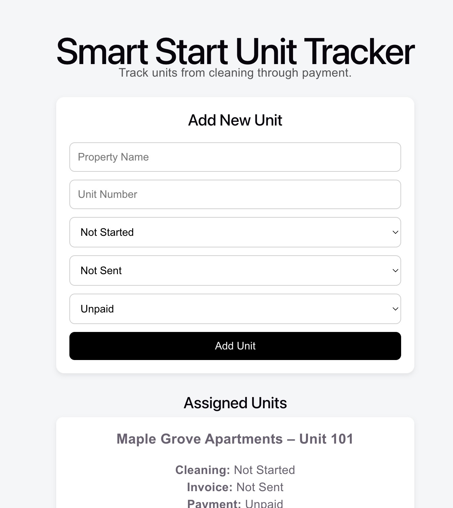
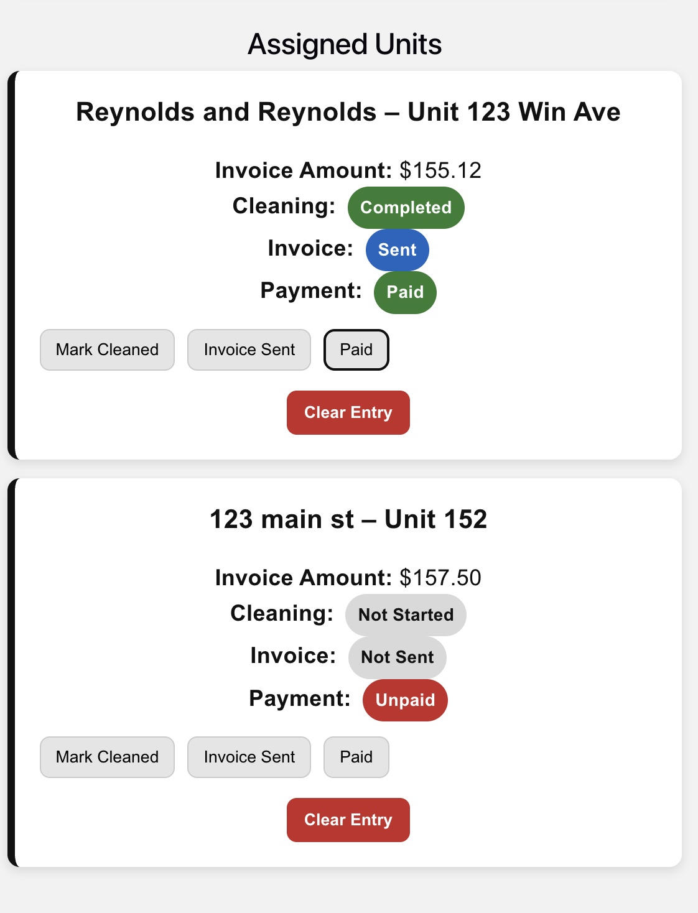

# Smart Start Unit Tracker

Smart Start Unit Tracker is a full-stack web application built to manage and track apartment cleaning workflows from assignment through invoicing and payment. The system allows users to organize and monitor units that require cleaning while maintaining visibility into job progress and financial status. This project was inspired by real-world operational needs in commercial cleaning services and demonstrates practical full-stack development skills.

## Key Features
- Add and manage apartment units that require cleaning
- Track cleaning status, invoice status, and payment status
- Display units in an organized dashboard view
- Remove completed or cleared units
- Persistent data storage using a SQLite database

## Technology Stack
- Frontend: React, Axios, CSS
- Backend: Node.js, Express.js
- Database: SQLite
- Tools: Git, GitHub, VS Code

## API Endpoints
- `GET /api/units` – Retrieve all units
- `POST /api/units` – Add a new unit
- `PATCH /api/units/:id` – Update unit status
- `DELETE /api/units/:id` – Remove a unit

This project demonstrates core full-stack concepts including REST API development, database integration, frontend state management, and building a workflow-based application.

## Screenshots

### Dashboard View

### Add Unit Form

